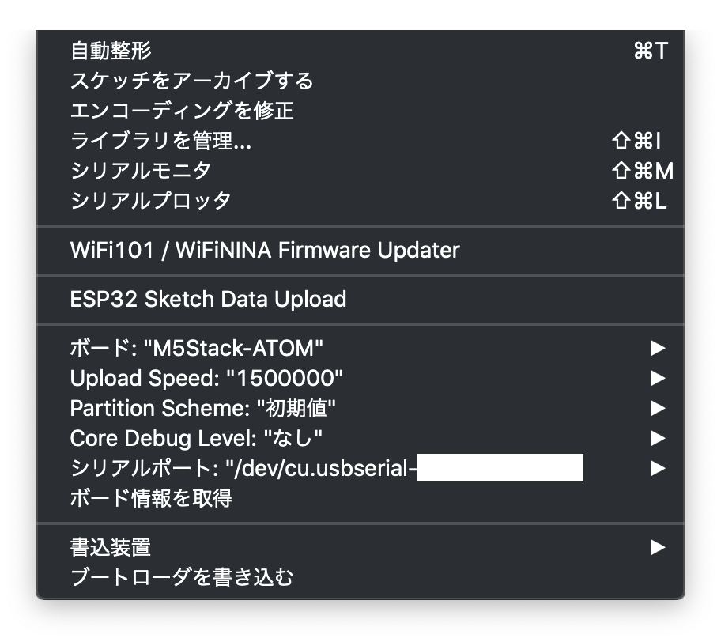

#  D+IO Project
**パナソニック株式会社/FUTURE LIFE FACTORY**
<br>D+IOプロジェクトは、人間が本来備え持っている創造力をエンパワーするプロジェクトです。
### [D+IO プロジェクト詳細](https://panasonic.co.jp/design/flf/works/doing_io/)
<a href="https://panasonic.co.jp/design/flf/works/doing_io/"></a>

<br><br>

## 【D+IO PRODUCT 第3弾】 簡易メッセージングデバイス EasyHOTLINE
第3弾は、ボタンを押すだけでLINEなどに定型文を送信できる「簡易メッセージング EasyHOTLIE」です。

**ソースコードは別リポジトリです**
<br>[https://github.com/panasonic-corporation/doingio-easy-hotline](https://github.com/panasonic-corporation/doingio-easy-hotline)


<br>


<br><br>
近年ではスマートフォンが普及し、いつでも誰かとコミュニケーションが取れる便利な世の中になりました。<br><br>
しかし、子供やお年寄りなどスマートフォンを所持していない方と手軽にコミュニケーションをとることはまだ難しいかもしれません。<br><br>
EasyHOTLINEは、家のコンセントに挿しておけばボタンを押すだけで「今から出かけます」や「今帰ったよ！」など、短いメッセージをLINEなどのメッセージアプリに送ることができます。<br><br>
一方通行ではありますが、簡単なコミュニケーションを取ることができます。<br><br>
他にも、ひとり暮らしでトイレに閉じ込められてしまった時にスマホを持っていない場合などにトイレにEasyHOTLINEを設置しておけば安心できるかもしれません。<br><br>
あなたなりのアイディアで利用シーンを想像しながらカスタマイズしてみましょう！<br><br>


# [easyHOTLINE] 作り方ドキュメント
M5Stack Basic / M5Stack Core2 / ATOM Matrix / ATOM Liteで作るeasyHOTLINEの作り方を紹介します。


**ソースコードは別リポジトリです<br>[https://github.com/panasonic-corporation/dio-easy-hotline](https://github.com/panasonic-corporation/dio-easy-hotline)**

  
# 作り方

## 1 準備

### 必要なパーツを用意


|     | 部品名                |  販売リンク（例）                                                   | 備考 |
|:----:|:---------------------|:----------------------------------------------------------------|:----|
|  1  | M5Stack Basic |[スイッチサイエンス](https://www.switch-science.com/catalog/3647/) | 1〜5のうちどれかひとつは必須 |
|  2  | M5Stack Core2 |[スイッチサイエンス](https://www.switch-science.com/catalog/6530/) | 1〜5のうちどれかひとつは必須 |
|  3  | ATOM Lite |[スイッチサイエンス](https://www.switch-science.com/catalog/6262/) | 1〜5のうちどれかひとつは必須 |
|  4  | ATOM Matrix |[スイッチサイエンス](https://www.switch-science.com/catalog/6260/) | 1〜5のうちどれかひとつは必須 |
|  5  | ATOM Echo |[スイッチサイエンス](https://www.switch-science.com/catalog/6260/) | 1〜5のうちどれかひとつは必須 |
|  6  | Micro SDカード | [Amazon](https://www.amazon.co.jp/dp/B07FC912NM) | M5Stack Basic, M5Stack Core2の場合必須 |
|  7  | USB TypeCケーブル | | M5Stack Basic, M5Stack Core2 に付属 |
|  8  | M5Stack 壁掛けケース | 3Dパーツ(非売品) | 3Dプリンタを使って出力できます([3Dデータ](https://github.com/panasonic-corporation/doingio-easy-hotline/blob/master/CaseModel/Body.stl)) |
|  9  | ケーブル巻取りケース | 3Dパーツ(非売品) | 3Dプリンタを使って出力できます([3Dデータ](https://github.com/panasonic-corporation/doingio-easy-hotline/blob/master/CaseModel/CableRoll.stl)) |

★ 参考価格（総額） : 約968円〜6,073円（税込み）


## 2 開発環境のダウンロードとインストール

下記リンクを参考に開発環境をインストールしてください。

[M5Stack開発環境のダウンロードとインストール](https://github.com/panasonic-corporation/doingio-base-docs/blob/master/README.md#a-m5stack%E9%96%8B%E7%99%BA%E7%92%B0%E5%A2%83%E3%81%AE%E3%83%80%E3%82%A6%E3%83%B3%E3%83%AD%E3%83%BC%E3%83%89%E3%81%A8%E3%82%A4%E3%83%B3%E3%82%B9%E3%83%88%E3%83%BC%E3%83%AB)

## 3 ファームウェアのダウンロード
1. ファームウェアをダウンロードしてください。

    https://github.com/panasonic-corporation/doingio-easy-hotline


1. プロジェクトを開いてください。
    ダウンロードしたフォルダを開き、doingio-easy-hotline/EasyHotline/EasyHotline.ino をダブルクリックしてArduino IDEで開きます。


## 4 ライブラリのダウンロードとインストール

1. ”スケッチ” → ”ライブラリをインクルード” → ”ライブラリを管理”「esp8266audio」と検索して「ESP8266Audio」をインストールしてください  
    


## 5 外部サービスとの連携
ここでは[LINE Messaging API](https://developers.line.biz/ja/services/messaging-api/)と連携する方法を記載します。

1. https://developers.line.biz/ja/services/messaging-api/ にアクセスして「今すぐはじめよう」をクリックします

    

1. アカウントを持っていなければ「アカウントを作成」してログインしてください。アカウントを持っていればそのままログインしてください。

    

1. Providerを設定していなければ「Create」から設定します。

    

1. Providerを選択したら「Create a new channel」を選択してチャンネルの作成に移ります。

    

1. channel typeはMessaging APIを選択します

    

1. 下記の通り設定し「Create」を押します。（同意文が出てきたらよく確認した上で同意してください。）

    

1. 続いて「LINE Official Account Manager」に移動します。「Basic settings」タブの「LINE Offical Account Manager」を選択してください。

    

1. 「応答設定」を選択し、下記の通り設定してください。

    

1. 先程のLINE Developersのサイトに移動し、「Messaging API」タブのQRコードをスマートフォンで読み取って、作ったチャンネルを友達に追加してください。

    

1. 「Messaging API」タブ一番下の「Channel access token」にある「Issue」を押してAccess Tokenを発行します。このあとの設定で使うのでコピーしておいてください。

    

### 6 config.h / EasyHotline.ino の設定

1. Arduino IDEの右上の逆三角アイコンをクリックし、config.hを選択します。
    

1. Arduino IDEでconfig.hを開き、下記項目を修正します。
    - DEVICE : 使用するデバイスの番号
        - M5Stack Basic の場合は 0
        - M5Stack Core2 の場合は 1
        - ATOM Lite の場合は 2
        - ATOM Matrix の場合は 3
        - ATOM Echo の場合は 4
    - WIFI_SSID  : WiFiのSSID
    - WIFI_PASSWORD : WiFiのパスワード
    - LINE_TOKEN : LINE Developersで取得したChannel Access Token
    - LINE_GROUP_ID : LINEでPUSHメッセージを送る場合に設定する送信先ID（ブロードキャスト送信の場合はコメントアウトしてください）
    - USE_BLE : BLEで周辺のデバイスにメッセージをAdvertiseする場合は true に設定してください。（USE_BLEを有効にする場合はArduinoの設定項目Partition Schemeを "No OTA" に設定してください。）
    

1. EasyHotline.inoを開き、定型文リストを設定してください。
下記の形式で "" の中に定型文を書き込んでください。

    ```
    const char* message_item[3] = {"aaa", "bbb", "ccc"};
    ```

    ATOM Matrix, ATOM Lite の場合は１つ目の定型文が送信されます。

1. 下記は標準でカスタマイズ可能です。

    - 画像【UI1/UI2】（ローディン時などに表示される画像）

    その他、様々なカスタマイズをしてみましょう！

### 7 MicroSDカードの準備(M5Stack Basic, M5Stack Core2の場合のみ)

1. SDカードをPCに差し込みます

1. doingio-easy-hotline/SD以下のフォルダすべてをSDカードにコピーします
    

1. SDカードをPCから抜き、M5Stack Basicに差し込みます

### 8 書き込み

1. PCとデバイスをUSBケーブルで接続し、Arduino IDEの「ツール」タブを開き下記の通り設定します。

- M5Stack Basic の場合

    

- M5Stack Core2 の場合

    

- ATOM Lite, ATOM Matrix, ATOM Echo の場合

    

1. 「書き込み」アイコンをクリックしてArduinoにファームウェアを書き込みます。

    

### 9 動作確認
- USBケーブルを電源に差すと起動します。


